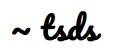

 

# Data Structures in Typescript 
Library of **data structures** implemented in Typescript.

### Data structures implemented in this library
- [Graph](./documentation/classes/Graph.html)
- [LinkedList](./documentation/classes/LinkedList.html)
- [Queue](./documentation/classes/Queue.html)
- [Stack](./documentation/classes/Stack.html)
- [Tree](./documentation/classes/Tree.html)
## To test the project
- `npm run test` - To test the library
- `test-watch` - To test the library in watch mode
- `test-coverage` - To generate the test coverage
- `npm run build` - To build the library
- `npm run docs` - To generate the docs

## Library documentation
- [Documentation](./documentation/index.html)
